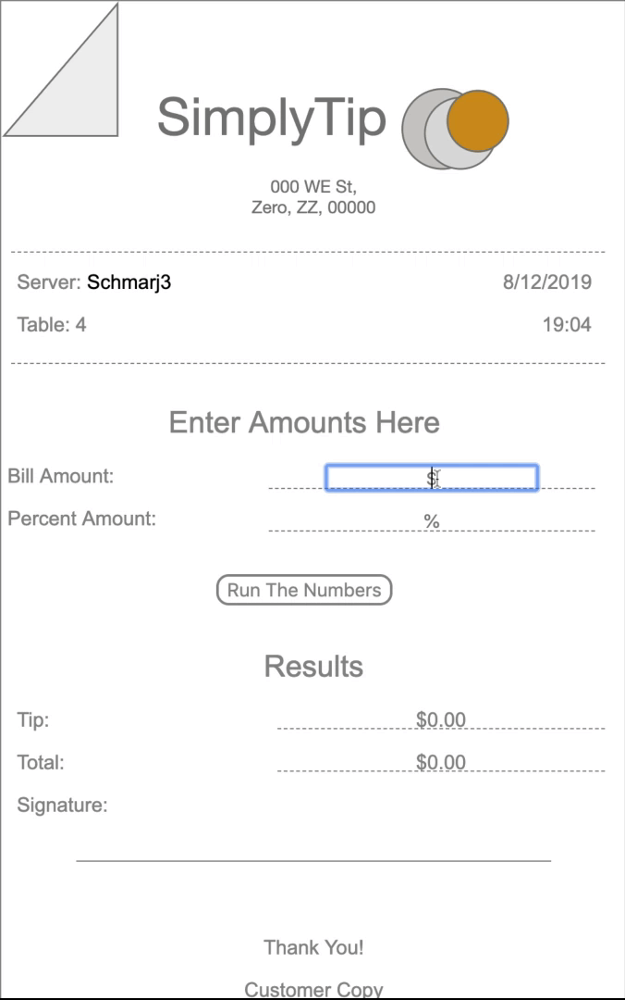

# SimplyTip
SimplyTip was inspired by an Andrew Mead challenge from his Udemy course titled [*The Modern JavaScript Bootcamp (2019)*](https://www.udemy.com/course/modern-javascript/).

## Table of Contents
[Demo](#demo)  
[Languages Used](#languages-used)  
[How To Use](#how-to-use)  
[Extra Features](#extra-features)  
[Author](#author)  
[Acknowledgments](#acknowledgments)  
[Notes](#notes)  

## [Demo](#demo)

## [Languages Used](#languages-used)
HTML5   
CSS  
JavaScript  

## [How To Use](#how-to-use)
There are places for users to input bill and percentage amounts.  
After entering a bill amount and percent amount, user should press "Run The Numbers" button to submit user input.  
The tip amount and the final bill including tip will show in the "Results" section.  

## [Extra Features](#extra-features)
Under the header to the right, there is an updated date and time stamp.  
Under the header to the left, the server is a link to my GitHub.  
Under server, there is a random table number set between 1 - 15.  

## [Author](#author)
**Marjorie Etienne**   
@schmarj3  
[MarjorieEtienne.com](marjorieetienne.com)

## [Acknowledgments](#acknowledgments)
* Andrew Mead's [*The Modern JavaScript Bootcamp (2019)*](https://www.udemy.com/course/modern-javascript/)

## [Notes](#notes)
The receipt header and coffee stain footer were created using Adobe XD